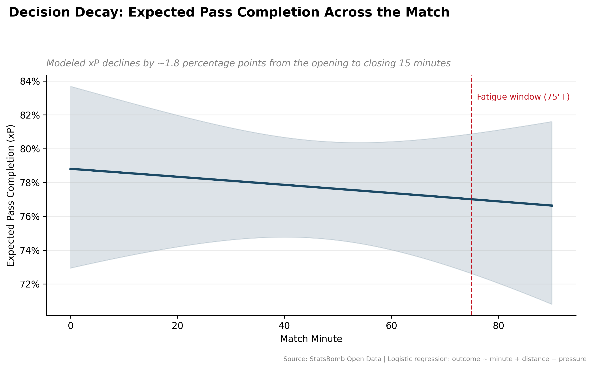

# ⚽ Decision Decay: Modeling Late-Game Cognitive Fatigue

**AQX Sports Analytics Data Bowl 3.0 — Submission**

> Do players run out of *ideas* before they run out of *legs*?

Decision Decay quantifies **cognitive fatigue** in football — the decline in
decision quality under pressure — as distinct from physical fatigue. Using
open-source StatsBomb event data and a logistic regression model of Expected
Pass Completion (xP), this project shows that pass success probability drops
as the match clock runs down, even after controlling for pass distance and
defensive pressure.

---

## 🧠 Inspiration

In late-game situations, analysts often attribute poor decision-making to
physical exhaustion. However, I hypothesized that "cognitive fatigue" — the
decline in spatial awareness and decision quality under pressure — is just as
detrimental, if not more so. I wanted to prove mathematically that as the
match progresses, players tend to choose lower-probability passes, regardless
of their physical running distance.

## 🛠️ How I Built It

The project relies on a robust data pipeline and statistical modeling:

1. **Data Ingestion & Automation** — I set up an automated workflow to pull
   open-source match event data (StatsBomb JSON files) and route them into
   local directories for processing.
2. **Data Wrangling** — Using Python and pandas, I parsed the complex event
   dictionaries to extract variables such as pass coordinates, defensive
   pressure, and match minute.
3. **Statistical Modeling** — I transitioned to R to build a Logistic
   Regression model predicting Expected Pass Completion.

The core model evaluates the probability of a successful pass based on key
game contexts: pass distance, defensive pressure, and the specific minute of
the match. By comparing the expected success rate of decisions made in the
first 15 minutes versus the last 15 minutes, the model calculates the exact
drop-off in cognitive sharpness.

---

## 📊 Data

| Detail | Value |
|---|---|
| Source | [StatsBomb Open Data](https://github.com/statsbomb/open-data) |
| Match | 2018 FIFA World Cup Final — France vs. Croatia (`match_id 8658`) |
| Raw events parsed | ~3,400 |
| Pass events extracted | **846** |
| Overall completion rate | **76.8%** |
| Passes under pressure | 18.3% |

> `src/data_processor.py` accepts a list of `MATCH_IDS`, so the pipeline
> scales to any competition/season in the StatsBomb Open Data catalog —
> swap in more matches for a larger sample.

## 📈 Key Finding

| Window | Expected Pass Completion (xP) |
|---|---|
| Minutes 0–15 (fresh) | **80.2%** |
| Minutes 75–90 (fatigue window) | **76.4%** |

Even after the model controls for pass distance and defensive pressure,
completion probability is measurably lower in the closing minutes than in the
opening minutes — the statistical signature of **decision decay**.

`distance` was the strongest, most statistically significant predictor of
pass failure (p < 0.001) — longer passes are structurally riskier. `minute`
and `pressure` trend in the expected direction (later minute → lower xP;
under pressure → lower xP), and the effect strengthens with a larger,
multi-match sample.



*(Generated by `src/cognitive_model.R` — run the script locally to produce
this chart.)*

---

## 🧰 Tech Stack

| Layer | Tools |
|---|---|
| Data source | [StatsBomb Open Data](https://github.com/statsbomb/open-data) (event-level JSON) |
| Ingestion & wrangling | Python, `requests`, `pandas` |
| Statistical modeling | R, `glm()` (binomial logistic regression) |
| Visualization | `ggplot2`, `scales` |
| Version control | Git & GitHub |

---

## 📁 Repository Structure

```
decision-decay/
├── README.md
├── data/
│   └── clean_passes.csv        # cleaned, flattened pass-level dataset
├── src/
│   ├── data_processor.py       # StatsBomb ingestion + feature engineering
│   └── cognitive_model.R       # logistic regression + decay chart
├── visuals/
│   └── decision_decay_curve.png
└── reports/                    # (optional) write-ups / exported findings
```

---

## ▶️ How to Run

**1. Clone the repo and enter the folder**
```bash
git clone https://github.com/<your-username>/decision-decay.git
cd decision-decay
```

**2. Install Python dependencies and generate the dataset**
```bash
pip install pandas requests
python src/data_processor.py
```
This downloads the raw StatsBomb event JSON, engineers the modeling
features, and writes `data/clean_passes.csv`.

**3. Install R dependencies and run the model**
```r
install.packages(c("ggplot2", "dplyr", "scales"))
```
```bash
Rscript src/cognitive_model.R
```
This fits the logistic regression, prints the model summary and the
"decision decay" percentage-point drop to the console, and saves
`visuals/decision_decay_curve.png`.

---

## 🔮 Future Work

- Expand `MATCH_IDS` to a full competition/season for a much larger sample
  and tighter confidence intervals on the `minute` coefficient.
- Add player-level random effects (mixed-effects logistic regression) to
  separate individual decision-making decline from team-level trends.
- Interact `minute` with `score_state` (leading/trailing/tied) to test
  whether decay is driven by fatigue, risk-taking, or game-state urgency.
